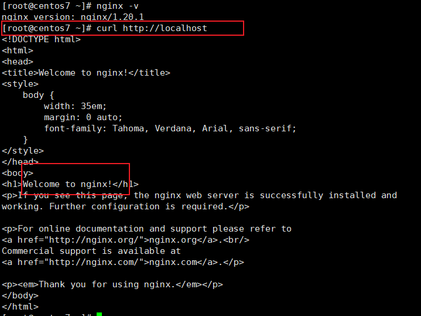

# Nginx

## 基础

访问量少时，jar 包运行在一台服务器上

访问量多时，需要多台服务器，但是不能独立访问，因为 session 是不共享的


暴露出两个需求

* 我们需要一个代理服务器，来管理多台应用服务器
* 某些服务器的性能比较好，需要更多的请求转发，需要负载均衡

第一阶段需要 Nginx （后面的阶段需要 springCloud）

架构的演进是一层层加上去的。没有什么是加一层解决不了的问题，如果有就再加一层。

> 如何理解高性能？

响应更快，并发更高

官方数据在50000个并发连接数的响应，tomcat 只有 500 个

> 如何理解反向代理？

正向代理：用户主动使用代理，比如使用 vpn，是代理客户端的。

反向代理，是代理服务器的，对用户无感知

> 如何理解负载均衡？

nginx 提供负载均衡策略有2种：内置策略和扩展策略。内置策略为轮询（平均）、加权轮询、IP hash。扩展策略：略。

* 轮询：平均权重
* 加权轮询：为性能好的服务器设置高的权重
* IP hash：通过计算 ip 固定的指向某一台服务器，可以确保 session 不丢失，但是如果服务器挂了，数据就会丢失，一般地，我们用 redis 来解决 **session 共享**的问题

* 动静分离：静态资源直接从 nginx 访问，能优化访问应用服务器和提升访问速度


## 安装（rpm）

官方下载：http://nginx.org/packages/

1. 安装源

```bash
wget http://nginx.org/packages/centos/7/noarch/RPMS/nginx-release-centos-7-0.el7.ngx.noarch.rpm
yum localinstall nginx-release-centos-7-0.el7.ngx.noarch.rpm
```

2. 安装

```bash
yum install nginx
nginx -v # 1.20.1
```

3. 启动

```bash
systemctl start nginx
curl localhost #用 curl 命令访问一次查看是否启动成功
```

4. 设置开机自启

```bash
systemctl enable nginx
# 重载所有修改过的配置文件
systemctl daemon-reload
```

5. 安装位置

    nginx的配置文件在/etc/nginx/nginx.conf

    自定义的配置文件放在/etc/nginx/conf.d

    项目文件存放在/usr/share/nginx/html/

    日志文件存放在/var/log/nginx/

    还有一些其他的安装文件都在/etc/nginx


## 配置

从 nginx.conf 配置文件，nginx 默认配置了 http ，http 默认是 80 端口，我们通过访问 http://localhost 能看到 `welcome to nginx` 表示 nginx 代理成功。

	


## 常用命令

```bash
nginx  启动 #通过 yum 安装，会自动注入到 PATH 中，命令可直接使用
nginx -s stop  #停止
nginx -s quit  #安全退出
nginx -s reload  #每次修改配置文件，d重新加载配置文件
ps aux|grep nginx  #查看nginx进程
```


## 实战

```nginx
http {
	# 配置负载均衡
    upstream xincan.com { 
        server 127.0.0.1:8080 weight=1;
        server 127.0.0.1:8081 weight=1;    
    }
    server {
        listen 80;
        # location 开头为反向代理的配置在
        location / { 
        	# proxy_pass http://127.0.0.1:88;  #代理一台
	        proxy_pass xincan.com # 引用负载均衡，可以一次代理多台，提高配置效率
		}
	}
}

```


